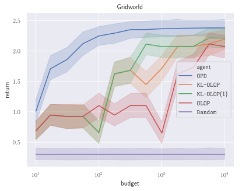
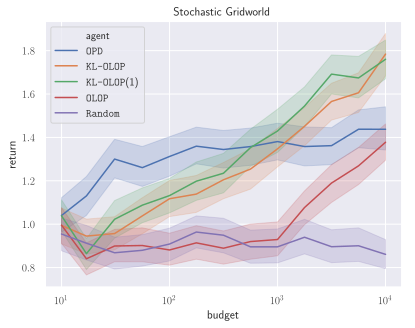

## Abstract

We consider the problem of online planning in a Markov Decision Process when given only access to a generative model, restricted to open-loop policies - i.e. sequences of actions - and under budget constraint. In this setting, the _Open-Loop Optimistic Planning_ (`OLOP`) algorithm enjoys good theoretical guarantees but is overly conservative in practice, as we show in numerical experiments. We propose a modified version of the algorithm with tighter upper-confidence bounds, `KL-OLOP`, that leads to better practical performances while retaining the sample complexity bound. Finally, we propose an efficient implementation that significantly improves the time complexity of both algorithms.

## Experiments

### Performances _w.r.t._ budget `n`

| Environment           | Expected return                    |
| :-------------------: | :-----------------------------:    |
| Highway               |        |
| Gridworld             |        |
| Stochastic Gridworld  |  |


### Expanded trees


## Reproduce the Experiments

### Install requirements

* The environments:
  * [highway-env](https://github.com/eleurent/highway-env)
  * [gym-minigrid](https://github.com/eleurent/gym-minigrid)
* The agents: [rl-agents](https://github.com/eleurent/rl-agents)

### Run the benchmark

```shell
cd <path-to-rl-agents>/scripts/
python planners_evaluation.py
```

### Usage
```
Usage: planners_evaluation.py [options]
Compare performances of several planners on random MDPs
Options:
  -h --help
  --generate <true or false>  Generate new data [default: True].
  --show <true_or_false>      Plot results [default: True].
  --data_path <path>          Specify output data file path [default: ./out/planners/data.csv].
  --plot_path <path>          Specify figure data file path [default: ./out/planners].
  --budgets <start,end,N>     Computational budgets available to planners, in logspace [default: 1,3,100].
  --seeds <(s,)n>             Number of evaluations of each configuration, with an optional first seed [default: 10].
  --processes <p>             Number of processes [default: 4]
  --chunksize <c>             Size of data chunks each processor receives
  --range <start:end>         Range of budgets to be plotted.
```
