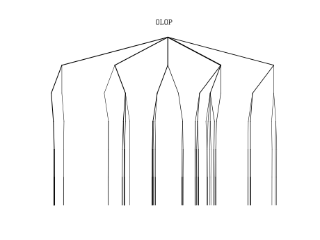
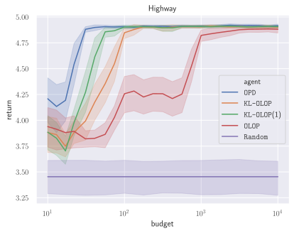

## Abstract

We consider the problem of online planning in a Markov Decision Process when given only access to a generative model, restricted to open-loop policies - i.e. sequences of actions - and under budget constraint. In this setting, the _Open-Loop Optimistic Planning_ (`OLOP`) algorithm enjoys good theoretical guarantees but is overly conservative in practice, as we show in numerical experiments. We propose a modified version of the algorithm with tighter upper-confidence bounds, `KL-OLOP`, that leads to better practical performances while retaining the sample complexity bound. Finally, we propose an efficient implementation that significantly improves the time complexity of both algorithms.

## Experiments

We compare several planning algorithms:
* **`OPD`** [Optimistic Planning for Deterministic Systems](https://hal.inria.fr/hal-00830182), Hren J., Munos R. (2008).
* **`OLOP`** [Open Loop Optimistic Planning](http://sbubeck.com/COLT10_BM.pdf), Bubeck S., Munos R. (2010).
* **`KL-OLOP`** An extension of `OLOP` with Kullback-Leibler upper confidence bounds.

### Expanded trees

We compare the trees expanded in the same root space of [highway-env](https://github.com/eleurent/highway-env) by the three algorithms, all provided with equal budget of `n = 1e3` calls to a generative model.

| |
|:--:|
|  | 
| `OPD` is tailored for deterministic systems and exploits this structure to explore a sparse near-optimal subtree. |
|  |
| `OLOP` behaves in the same way as uniform planning, and fails to identify the optimal trajectory. |
|  |
| `KL-OLOP` explores a tree similar to that of `OPD` despite supporting the larger class of stochastic systems, and successfully returns the optimal trajectory. |

### Performances

We evaluate the expected return obtained by these algorithms with respect to their numerical budgt `n` in three different enviroments.

| Environment           | Expected return                    |
| :-------------------: | :-----------------------------:    |
| Highway               |        |
| Gridworld             |        |
| Stochastic Gridworld  |  |

## Reproduce the Experiments

### Install requirements

* The environments:
  * [highway-env](https://github.com/eleurent/highway-env)
  * [gym-minigrid](https://github.com/eleurent/gym-minigrid)
* The agents: [rl-agents](https://github.com/eleurent/rl-agents)

### Run the benchmark

```shell
cd <path-to-rl-agents>/scripts/
python planners_evaluation.py
```

### Usage
```
Usage: planners_evaluation.py [options]
Compare performances of several planners on random MDPs
Options:
  -h --help
  --generate <true or false>  Generate new data [default: True].
  --show <true_or_false>      Plot results [default: True].
  --data_path <path>          Specify output data file path [default: ./out/planners/data.csv].
  --plot_path <path>          Specify figure data file path [default: ./out/planners].
  --budgets <start,end,N>     Computational budgets available to planners, in logspace [default: 1,3,100].
  --seeds <(s,)n>             Number of evaluations of each configuration, with an optional first seed [default: 10].
  --processes <p>             Number of processes [default: 4]
  --chunksize <c>             Size of data chunks each processor receives
  --range <start:end>         Range of budgets to be plotted.
```

### Run a single agent

To visualize a single agent interacting with an environment, run:
```shell
cd <path-to-rl-agents>/scripts/
python experiments.py evaluate <path/to/env.json> <path/to/agent.json> --test --episodes=1
```
The following agent configurations can be used:

#### odp.json

```
{
    "__class__": "<class 'rl_agents.agents.tree_search.deterministic.DeterministicPlannerAgent'>",
    "gamma": 0.8,
    "budget": 500
}
```

#### olop.json

```
{
    "__class__": "<class 'rl_agents.agents.tree_search.olop.OLOPAgent'>",
    "gamma": 0.8,
    "budget": 500,
    "upper_bound": {
        "type": "hoeffding",
        "c": 4
    },
    "lazy_tree_construction": true,
    "continuation_type": "uniform"
}
```

#### kl-olop.json

```
{
    "__class__": "<class 'rl_agents.agents.tree_search.olop.OLOPAgent'>",
    "gamma": 0.8,
    "budget": 500,
    "upper_bound": {
        "type": "kullback-leibler",
        "c": 2
    },
    "lazy_tree_construction": true,
    "continuation_type": "uniform"
}
```

Note that the line `"env_preprocessors": [{"method":"simplify"}]` should be added to decrease computation time in the `highway-env` environment.
